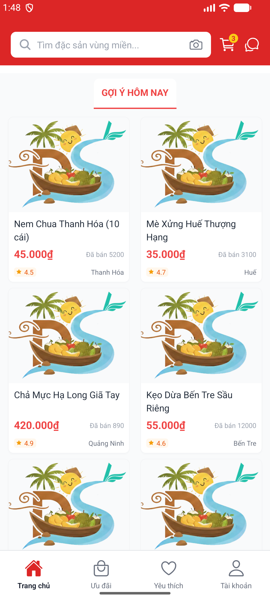
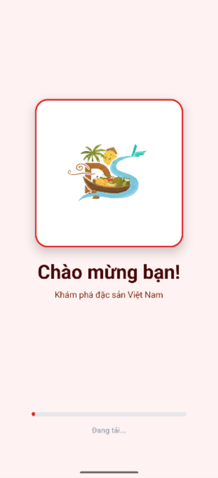
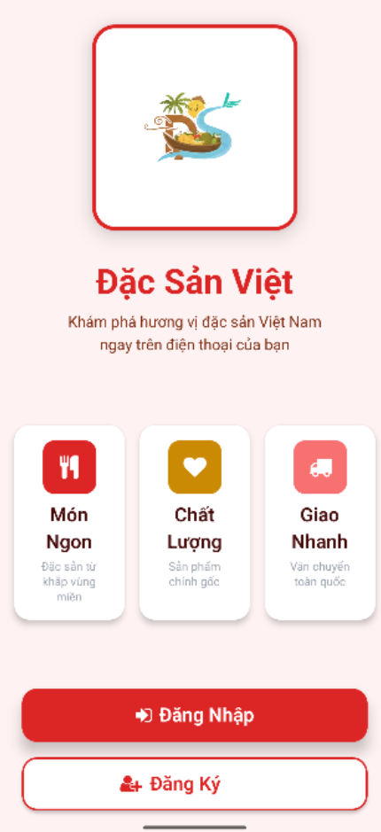
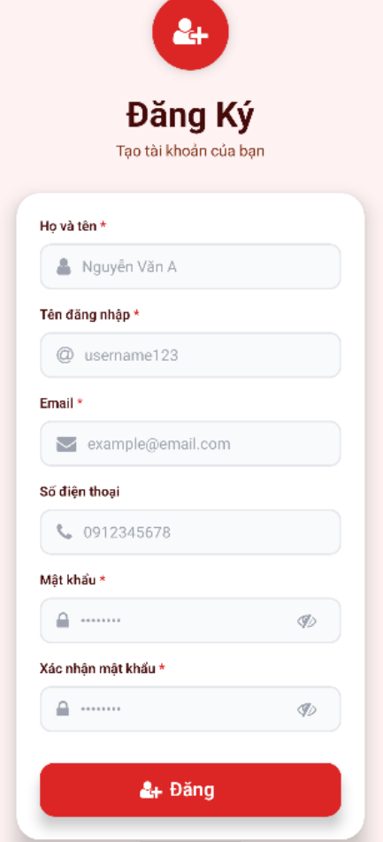

# Đặc Sản Việt Mobile App

Ứng dụng React Native (TypeScript + Expo) cho mạng lưới đặc sản Việt Nam với giao diện hiện đại, xác thực OTP, và kiến trúc component modular.

## Tính năng chính

### 🔐 Xác thực & Bảo mật
- ✅ Đăng ký tài khoản với xác thực OTP qua email
- ✅ Đăng nhập với JWT tokens (Access & Refresh)
- ✅ Quên mật khẩu với OTP verification
- ✅ Đặt lại mật khẩu an toàn
- ✅ Session management tự động
- ✅ Auto-refresh token khi hết hạn
- ✅ Secure storage cho tokens

### 🎨 Giao diện người dùng
- ✅ **Homepage** với UI/UX hiện đại theo phong cách e-commerce
- ✅ **Modular Component Architecture** dễ bảo trì và mở rộng
- ✅ **Custom OTP Input** với animation đẹp mắt
- ✅ **Bottom Tab Navigation** với 4 tabs: Trang chủ, Ưu đãi, Yêu thích, Tài khoản
- ✅ **Product Cards** với hình ảnh, giá, giảm giá, và rating
- ✅ **Category Grid** 4 cột cho danh mục sản phẩm
- ✅ **Flash Sale Section** với countdown timer
- ✅ **Recommended Products** với grid layout
- ✅ **Banner Slider** cho quảng cáo
- ✅ **Search Header** với giỏ hàng và chat icons
- ✅ Responsive design tương thích đa thiết bị
- ✅ Loading states và error handling
- ✅ Real-time form validation

### 🛠 Công nghệ sử dụng
- ⚛️ **React Native** với **TypeScript** cho type safety
- 📱 **Expo SDK** cho rapid development
- 🧭 **React Navigation v6** (Stack Navigation)
- 🎨 **NativeWind** (Tailwind CSS for React Native)
- 🌐 **Axios** cho API calls với interceptors
- 💾 **AsyncStorage** cho local storage
- 🪝 **Custom Hooks** (useAuth, useForm, useUser, useHomepage)
- 🎭 **@expo/vector-icons** (Ionicons, FontAwesome)
- 🔄 **Auto-refresh tokens** mechanism
- 📦 **Modular folder structure** theo Clean Architecture
## Yêu cầu
- Node.js 16+, npm/yarn
- Expo CLI
- Emulator iOS/Android hoặc thiết bị thật

## Cài đặt & cấu hình API

```bash
npm install
```

Chỉnh `API_BASE_URL` trong `services/api.ts` về IP máy bạn (ví dụ: `http://YOUR_IP:3001/api`).

## Chạy ứng dụng

```bash
npm start
npm run ios
npm run android
npm run web
```
## Luồng điều hướng

```
Intro → Welcome → Login/Register → Homepage
Forgot password: Login → Quên mật khẩu → Nhập email → Nhập OTP → Reset password
```

## Demo giao diện
### Trang chủ 
<table align="center">
  <tr>
    <td align="center">
      
      <br />
    </td>
    <td align="center">
      
      <br />
    </td>
  </tr>
</table>
<div align="center">
  <em>Giao diện trang chủ</em>
</div>
### Authentication Flow
<table>
  <tr>
    <td align="center">
      <br/>
      <em>Màn hình loading</em>
    </td>
    <td align="center">
      <br/>
      <em>Màn hình giới thiệu cá nhân</em>
    </td>
  </tr>
  <tr>
    <td align="center">
      <br/>
      <em>Màn hình Welcome</em>
    </td>
    <td align="center">
      <br/>
      <em>Giao diện trang đăng nhập đơn giản</em>
    </td>
    <td align="center">
      <br/>
      <em>Giao diện trang đăng ký đơn giản</em>
    </td>
  </tr>
    <tr>
    <td align="center">
      
      <br />
      <em>Giao diện quên mật khẩu</em>
    </td>
    <td align="center">
      
      <br />
      <em>Giao diện trang nhập mã OTP</em>
    </td>
    <td align="center">
      
      <br />
      <em>Giao diện Email gửi mã xác thực khi quên mật khẩu</em>
    </td>
  </tr>
  <tr>
    <td align="center">
      
      <br />
      <em>Giao diện nhập mã OTP khi đăng kí</em>
    </td>
<td align="center">
      
      <br />
      <em>Giao diện Email gửi mã xác thực đăng kí</em>
    </td>
<td align="center">
      
      <br />
      <em>Giao diện Email khi đăng kí thành công</em>
    </td>
  </tr>
</table>

## Cấu trúc dự án

```
react-native-mobile/
├── components/                      # Reusable UI components
│   ├── BottomTab.tsx               # Bottom navigation (4 tabs)
│   ├── PrimaryButton.tsx           # Custom button component
│   ├── TextField.tsx               # Custom text input component
│   ├── ProductCard.tsx             # Product display card
│   ├── HomepageHeader.tsx          # Search header with cart & chat
│   ├── GreetingSection.tsx         # User greeting component
│   ├── BannerSlider.tsx            # Promotional banner slider
│   ├── CategorySection.tsx         # Category grid (4 columns)
│   ├── FlashSaleSection.tsx        # Flash sale horizontal scroll
│   ├── RecommendedSection.tsx      # Recommended products grid
│   └── HomepageFooter.tsx          # Footer branding
│
├── hooks/                           # Custom React hooks
│   ├── useAuth.ts                  # Authentication logic
│   ├── useForm.ts                  # Form validation & state
│   ├── useUser.ts                  # User profile management
│   └── useHomepage.ts              # Homepage data & logic
│
├── constants/                       # App constants
│   ├── theme.ts                    # Colors, fonts, sizes, spacing
│   └── mockData.ts                 # Mock categories & products
│
├── screens/                         # App screens
│   ├── IntroScreen.tsx             # Loading screen with logo
│   ├── WelcomeScreen.tsx           # Landing page with CTA buttons
│   ├── LoginScreen.tsx             # Email/Username login form
│   ├── RegisterScreen.tsx          # Registration form (6 fields)
│   ├── VerifyRegisterOTPScreen.tsx # OTP verification for registration
│   ├── ForgotPasswordScreen.tsx    # Forgot password flow
│   ├── HomepageScreen.tsx          # Main dashboard (refactored)
│   └── ProfileScreen.tsx           # User account settings
│
├── services/                        # API & external services
│   ├── api.ts                      # Axios client with interceptors
│   └── RealmService.ts             # Local database (if needed)
│
├── store/                           # State management
│   ├── AuthProvider.tsx            # Auth context provider
│   └── authStore.ts                # Auth state with Zustand
│
├── types/                           # TypeScript type definitions
│   ├── api.ts                      # API request/response types
│   ├── navigation.ts               # Navigation stack types
│   ├── profile.ts                  # User profile types
│   └── product.ts                  # Product & Category types
│
├── utils/                           # Helper functions
│   ├── storage.ts                  # AsyncStorage wrapper
│   ├── validation.ts               # Form validation rules
│   └── format.ts                   # Data formatting utilities
│
├── navigation/                      # Navigation setup
│   ├── AppNavigator.tsx            # Main navigation container
│   └── index.ts                    # Navigation exports
│
├── assets/                          # Static resources
│   ├── dacsanvietLogo.webp        # Brand logo
│   ├── icon.png                    # App icon
│   ├── splash-icon.png             # Splash screen
│   └── adaptive-icon.png           # Android adaptive icon
│
├── screenshots/                     # App screenshots for demo
│   ├── loadingScreen.png
│   ├── welcome.png
│   ├── loginScreen.png
│   ├── registerScreen.png
│   ├── inputotpregister.png
│   ├── forgotpass.png
│   ├── otpforgotpass.png
│   ├── resetpass.jpg
│   ├── registerotp.jpg
│   ├── mailinfo.jpg
│   └── img.png
│
├── scripts/                         # Utility scripts
│   └── update-ip.js                # Auto-update API IP address
│
├── App.tsx                          # Root component
├── index.ts                         # Entry point
├── app.json                         # Expo configuration
├── babel.config.js                 # Babel configuration
├── tailwind.config.js              # NativeWind configuration
├── tsconfig.json                   # TypeScript configuration
├── package.json                     # Dependencies & scripts
└── README.md                        # Project documentation
```

## API Integration

### Backend Server
- **Framework**: Node.js + Express
- **Database**: MySQL
- **Authentication**: JWT + OTP
- **Email Service**: Nodemailer với Gmail

### API Endpoints
```
POST   /api/auth/register                  # Đăng ký (legacy)
POST   /api/auth/send-registration-otp    # Gửi OTP đăng ký
POST   /api/auth/verify-registration-otp  # Xác thực OTP đăng ký
POST   /api/auth/login                    # Đăng nhập
POST   /api/auth/send-password-reset-otp  # Gửi OTP reset password
POST   /api/auth/reset-password-otp       # Reset password với OTP
POST   /api/auth/logout                   # Đăng xuất
GET    /api/health                        # Health check
```

### Environment Variables
```
# Server
PORT=3001
NODE_ENV=development

# Database
DB_HOST=localhost
DB_PORT=3306
DB_USER=root
DB_PASSWORD=your_password
DB_NAME=DacSanViet

# JWT
JWT_SECRET=your-secret-key
JWT_EXPIRES_IN=24h

# Email (Gmail)
EMAIL_HOST=smtp.gmail.com
EMAIL_PORT=587
EMAIL_USER=your-email@gmail.com
EMAIL_PASS=your-app-password
```

## User Flow

### Đăng ký tài khoản
1. Nhập thông tin cá nhân
2. Gửi OTP đến email
3. Nhập mã OTP 6 số
4. Xác thực thành công → Tự động đăng nhập

### Đăng nhập
1. Nhập email/username và mật khẩu
2. Xác thực thành công → Lưu JWT tokens
3. Chuyển đến trang chủ

### Quên mật khẩu
1. Nhập email
2. Gửi OTP đến email
3. Nhập mã OTP 6 số
4. Nhập mật khẩu mới
5. Xác nhận mật khẩu → Cập nhật thành công

## Test Accounts
### Admin Account
- Email: admin@dacsanviet.com
- Password: admin123
